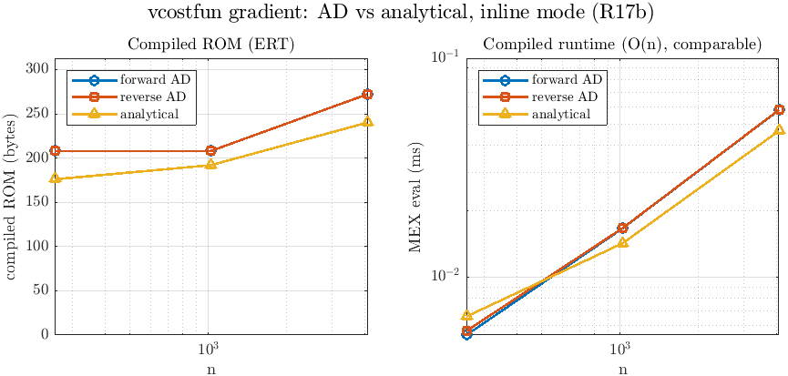

# Derivative showcase — which mode should I pick?

Roadmap **R17** (issue #73 item B), MATLAB level. One derivative of a curated
anchor function generated through every relevant axis, with its generated-code
complexity measured and its value checked against the analytic derivative. This
is the "which mode should I pick?" artifact.

Each AD axis is also measured against a hand-coded **analytical** derivative —
the "do I even need this tool?" baseline and the gold correctness oracle (#73).
It's a reference *column*, not a grid cell: a hand derivative has no
embed/slim/unroll variants, so it appears once per DerType with those fields
blank (`mode = ana`, `—` elsewhere).

Regenerate this table with:

```matlab
addpath bench
r = derivShowcase('n',6,'reportPath','bench/showcase_table.md');   % MATLAB level
```

The **C level** (compiled-C size + `timeit` MATLAB-vs-MEX runtime over an
`n`-sweep, via MATLAB Coder / `matlabtest.coder.TestCase`) is **R17b** and adds
the runtime columns + a figure.

## Anchors

- `scostfun(x)` — scalar cost with a **rolled loop** and subscripting,
  `J = Σₖ (exp(xₖ) + 2xₖ)` (the allocation/`loopbound` shape). Exercises
  gradient, Hessian, forward & reverse, rolled & unrolled.
- `vcostfun(x)` — the same cost **vectorized** (`sum(exp(x)+2x)`, no
  subscripting). Its reverse adjoint references no index tables.
- `vfun(x)` — vector output with a diagonal (sparse) Jacobian, for the Jacobian
  axis.
- `vvecfun(x)` — a vectorized vector output (`sin(x)+x.^2`), the unrolled
  Jacobian anchor at C level.
- `showcase/analytic/*.m` — hand-coded analytical grd/jac/hes of the anchors,
  the AD-vs-analytical reference (each FD-checked once by `SDerivShowcaseTest`).

## Snapshot (n = 6)

| function | DerType | mode | slim | unroll | der_levels | code lines | .mat bytes | idx tables | idx elems | correct |
|---|---|---|---|---|---|---:|---:|---:|---:|---|
| scostfun | gradient | c | 0 | 0 | — | 46 | 478 | 3 | 78 | ok |
| scostfun | gradient | l | 1 | 0 | — | 41 | 310 | 3 | 78 | ok |
| scostfun | gradient | i | 1 | 0 | — | 51 | 0 | 0 | 0 | ok |
| scostfun | gradient | i | 0 | 0 | — | 51 | 0 | 0 | 0 | ok |
| scostfun | gradient | i | 1 | 1 | — | 130 | 0 | 0 | 0 | ok |
| scostfun | hessian | c | 0 | 0 | — | 124 | 1038 | 11 | 246 | ok |
| scostfun | hessian | i | 1 | 0 | — | 142 | 0 | 0 | 0 | ok |
| scostfun | hessian | i | 1 | 0 | [2] | 140 | 0 | 0 | 0 | ok |
| scostfun | gradient-reverse | c | 0 | 1 | — | 177 | 288 | 12 | 12 | ok |
| scostfun | gradient-reverse | l | 0 | 1 | — | 172 | 288 | 12 | 12 | ok |
| scostfun | gradient-reverse | i | 0 | 1 | — | 187 | 0 | 0 | 0 | ok |
| vfun | jacobian | c | 0 | 0 | — | 45 | 484 | 4 | 120 | ok |
| vfun | jacobian | i | 1 | 0 | — | 50 | 0 | 0 | 0 | ok |
| vfun | jacobian | i | 1 | 1 | — | 135 | 0 | 0 | 0 | ok |
| vcostfun | gradient | l | 0 | 1 | — | 24 | 249 | 1 | 6 | ok |
| vcostfun | gradient-reverse | l | 0 | 1 | — | 18 | 0 | 0 | 0 | ok |
| vcostfun | gradient | ana | — | — | — | 4 | 0 | 0 | 0 | ok |
| vcostfun | hessian | ana | — | — | — | 5 | 0 | 0 | 0 | ok |
| vvecfun | jacobian | ana | — | — | — | 4 | 0 | 0 | 0 | ok |

(Numbers are a snapshot; regenerate as above. `SDerivShowcaseTest` guards
correctness + the headline relationships, not the exact figures.)

## How to read it

- **`embed_mode`** is a *where-does-the-constant-data-live* knob, not a numeric
  one (all three are bit-identical, DESIGN §Contracts C-4): `c`/`l` keep the
  index tables in a `.mat` (small code, non-zero `.mat bytes`); `i` inlines them
  as source (no `.mat`, more `code lines`). Pick `i` for a fully self-contained
  artifact, `l` when the constants are large and you'd rather not inline them.
- **`slim`** trims unread `_location`/`_size` chains, so the unreferenced index
  tables drop in the prune — visible as fewer `.mat bytes` / `idx elems` (e.g.
  `scostfun` gradient `c`→`l`+slim: 478→310 bytes).
- **`unroll`** trades code for loops: unrolling the rolled anchor multiplies
  `code lines` (e.g. gradient `i` 51→130) — keep `unroll=0` for code size.
- **`der_levels`** drops the lower-order companions (Hessian `[2]` returns just
  `Hes`, no `Grd`/`Fun`) — marginal here, larger when `Fun`/`Grd` assembly is
  expensive.
- **forward vs reverse** is the headline. For the *gradient* of a scalar cost,
  reverse carries **zero static data** when the adjoint is fully vectorized
  (`vcostfun` reverse: 0 bytes / 0 tables, vs forward `l`: 249 bytes / 1 table —
  the `1:n` nonzero-location map). With subscripting (`scostfun`) the reverse
  still carries its subscript maps, but the gradient ROM never grows with the
  number of variables the way a forward *dense* Jacobian/Hessian does (ANALYSIS
  §3.5). Use reverse (`gradient-reverse`) for objective gradients / first-order
  embedded solvers; forward for Jacobians and where `m ≈ n`.
- **AD vs analytical** is the user-facing column ("do I even need this tool?").
  A hand derivative is tiny here — `4`–`5` code lines vs the AD wrapper's `18`
  (vectorized reverse) to `187` (rolled reverse) — and carries no data, because a
  human writes the closed form directly. That's expected and is the *point*: for
  a simple cost, hand-coding wins; AD's value is at scale, where the derivative
  is large/sparse enough that deriving and maintaining it by hand becomes
  impractical or silently drops sparsity. The crossover — not a win/lose — is the
  story (the compiled-footprint side of it lands in R17c). The analytical
  derivatives double as the **gold correctness oracle** (FD-checked once, then the
  equivalence reference).

## C level (R17b + R17c)

`bench/derivShowcaseC.m` carries the embeddable (`i`/inline) cells the rest of
the way: through **Embedded Coder (ERT)** to a static `lib`, then measures the
**honest compiled footprint** of the derivative function — ROM (`.text`+`.rdata`),
static RAM (`.data`+`.bss`) via `size -A`, and max stack via `gcc -fstack-usage`
(**R17c**) — alongside a MEX for numeric equivalence + runtime, and compile time.
Skip-clean where Coder (or the standalone `gcc`/`size` toolchain) is absent.

```matlab
addpath bench
rc = derivShowcaseC('n',8,'figPath','bench/showcase_scaling.png');
```

Snapshot (inline mode, n = 8, MATLAB R2024a + MinGW; ROM/RAM/stack in bytes):

| function | DerType | impl | unroll | ROM | RAM | stack | MEX≡analytic | MEX (ms)² | MATLAB (ms)² | compile (s)² | C src (B)¹ |
|---|---|---|---:|---:|---:|---:|---|---:|---:|---:|---:|
| vcostfun | gradient | AD | 1 | 208 | 0 | 160 | yes | 0.003 | 0.168 | 14.9 | 19505 |
| vcostfun | gradient-reverse | AD | 1 | 208 | 0 | 160 | yes | 0.002 | 0.006 | 3.2 | 17940 |
| vcostfun | gradient | analytic | — | 160 | 0 | 160 | yes | 0.002 | 0.001 | 3.7 | 17764 |
| vcostfun | hessian | AD | 1 | 224 | 0 | 160 | yes | 0.002 | 0.075 | 2.9 | 20576 |
| vcostfun | hessian | analytic | — | 224 | 0 | 144 | yes | 0.002 | 0.002 | 3.0 | 18633 |
| vvecfun | jacobian | AD | 1 | 224 | 0 | 304 | yes | 0.002 | 0.051 | 2.7 | 19307 |
| vfun | jacobian | AD | 0 | 448 | 0 | 288 | yes | 0.003 | 0.248 | 3.5 | 20484 |
| vvecfun | jacobian | analytic | — | 176 | 0 | 176 | yes | 0.003 | 0.001 | 2.8 | 17948 |

> **ROM/RAM/stack are the compiled footprint of the derivative *function*** —
> the `<wrapper>.c` (+ `<wrapper>_data.c` static tables) object, excluding the
> lifecycle stubs, the `examples/` main and the `interface/` MEX gateway (none
> deploy to the target). Measured from the ERT object with `size` /
> `-fstack-usage`, not the codegen report (whose static-code-metrics tables
> silently do not populate for generated AD code — [ADR-0027](../docs/decisions/ADR-0027-compiled-memory-metrics.md)).
> ¹ `C src (B)` is the old sum of generated `.c`/`.h` *source* bytes — kept only
> as a boilerplate-dominated proxy; **do not read it as ROM** (its small
> forward-vs-reverse spread is comments, not footprint). ² runtime + compile
> columns are single-sample and machine-dependent — read as order-of-magnitude.

**The honest finding: for these vectorized costs the footprints CONVERGE.**
Forward and reverse gradient are byte-identical (ROM 208 / 208), the analytical
floor is only ~50 B under, and **static RAM is 0 across the board** — the
embeddable (`i`) forms carry ≈0 static data, so there is no ROM/RAM story to tell
them apart. This retires the earlier "reverse compiled C is ~8% leaner" reading,
which was computed from *source* bytes (boilerplate-dominated) and does **not**
survive to the compiled object. The forms that *would* differ (data-heavy index
tables) are exactly the ones still blocked on the Embedded-Coder codegen gaps in
[#80](https://github.com/pdlourenco/adigator-embedded/issues/80).



- **AD vs analytical is a *code-lines* story here, not a footprint one.** The hand
  derivative is 4–5 lines vs the AD wrapper's 18–187 (MATLAB-level table above),
  and both compile to ≈0-data objects of comparable ROM. For these *simple* costs
  hand-coding is cheapest, as expected — the value of AD is the **crossover** at
  scale, where the derivative grows large/sparse enough that hand-deriving it
  becomes impractical or silently drops sparsity. The analytical column also
  doubles as the gold correctness oracle (`SDerivShowcaseTest` FD-checks it once).
- **Runtime is COMPARABLE, not a reverse win** (the figure's right panel,
  and #73's runtime axis). Across `n` = 256 / 1024 / 4096 the compiled MEX times
  are forward and reverse both O(n) and within noise of each other. The
  forward-vs-reverse choice here is bought with **neither footprint nor speed** —
  it is a code-generation-style preference at this scale.
- **Compiled ROM is roughly `n`-flat for a vectorized cost** (left panel): `n` is
  a runtime array length, not unrolled code, so neither the generated code nor its
  ≈0 static data grows with the number of variables.
- **rolled vs unrolled, to C:** `vvecfun` (unrolled, ROM 224) vs `vfun` (rolled,
  ROM 448) Jacobian both compile and match — the rolled loop pays a modest ROM +
  stack premium here. Note **rolled *scalar-cost* gradient/Hessian do not codegen**
  (a separate concern, ANALYSIS §2.3(7) / roadmap R19), so the rolled axis reaches
  C here only for the Jacobian; the MATLAB-level table above covers the rest.
- **MEX ≡ analytic exactly** on every cell (the embed-mode C-4 guarantee
  compiled). `SCodegenShowcaseTest` pins build + numeric equivalence **and** the
  measured footprint (ROM/RAM/stack populated, forward/reverse convergence).

